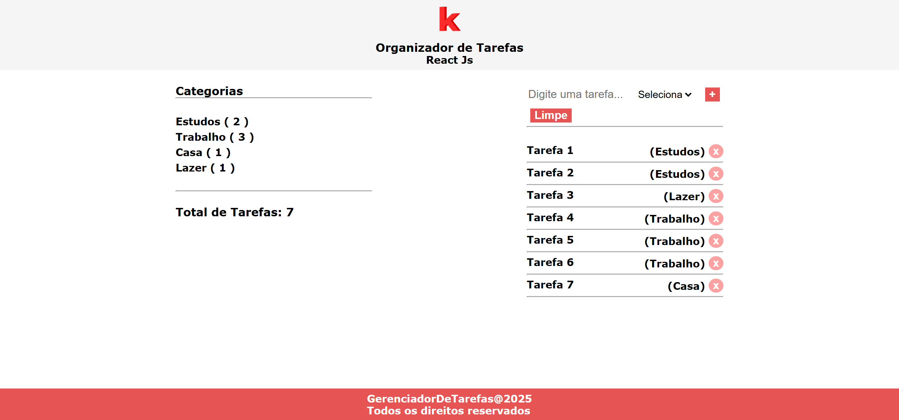

# Organizador de Tarefas
## React Js

 

Acesse o projeto: [Organizador de Tarefas](https://organizador-de-tarefas-one.vercel.app/) 

### 1. Sobre o projeto

Projeto simples que demonstra o uso de Context API para controlar o estado da aplicação e CSS modules para uma melhor organização para layout responsivo e bem estruturado.

### 4. Instalação das dependências

Instalar dependências: **npm install**

Rodar aplicação: **npm run dev**

### 5. Contatos

E-mail: [kba.2879@gmail.com](mailto:kba.2879@gmail.com) 
Linkedin: [/katarine-albuquerque](https://www.linkedin.com/in/katarine-albuquerque/)  
GitHub: [/katarinebalbuquerque](https://github.com/katarinebalbuquerque)  
